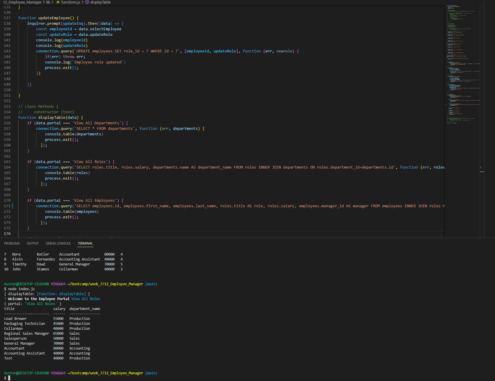

# Employee Database

## Description
An employee management system built on a mysql database. Easily view existing entries or add new departments, roles, and individual employees.

## Installation
Install all dependencies by typing 'npm i' into the terminal from the root folder. Log into your mysql shell and create the database by running 'source ./db/schema.sql;' then exit the shell. Run the command 'npm start' to start the program where you'll be greeted by a prompt to select the action you wish to perform.

## Usage
After you've installed all dependencies and created the database through mysql, simply run the command 'npm start' to enter the program. Select the action you wish to perform from the dropdown menu and follow the prompts to add or update new fields.
[Link to Demo Video](https://drive.google.com/file/d/1FIth1dMpSZUNOLhTNaeRcPpYzGjPSatn/view)
## Credits
n/a